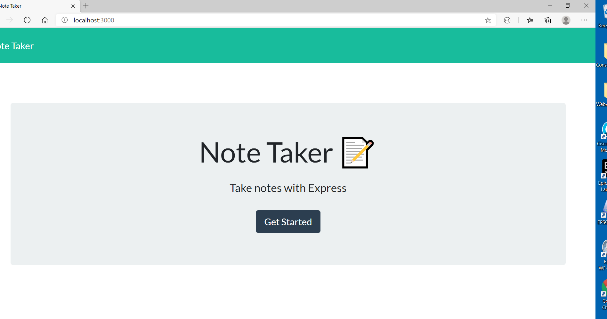
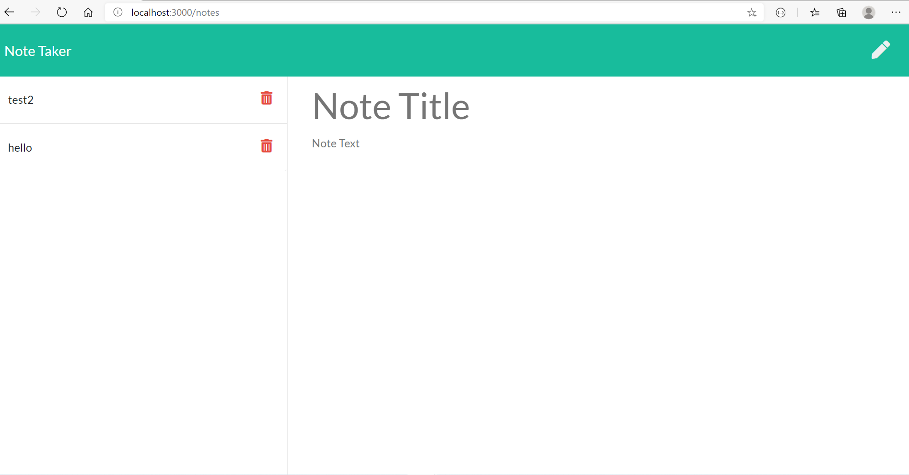
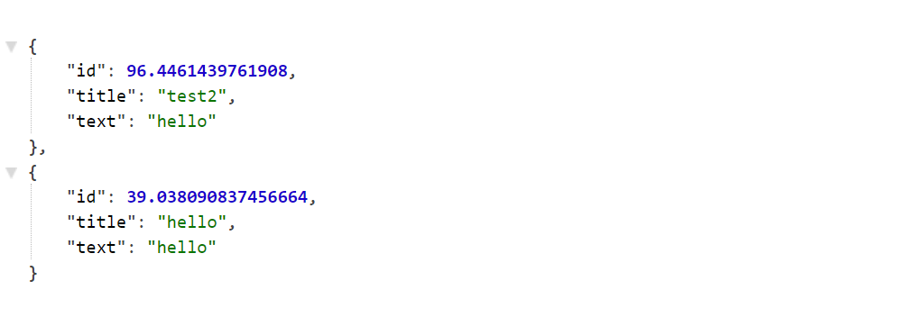

# note-taker-11.17.20

## About The Project

---

This application is about Note Taker from Command Line Interface
This application allows user to add notes.
First applicatin displays prevously saved notes in Note Taker section in leftside of the app.
In the middle of app displays with place holders as Note Title and Note Text,user can enter Note
Title and Note Text in place holder's section and click save button on right side of the upper corner,
refresh the page then newly added notes will be added to Note Taker section.If user wants add more notes ,
user can click on pen symbol on right side of the upper corner and can enter note title and text and click on save button.
if user wants delete notes from the Note Taker list item,need to click on delete button besides the note in Note Taker section,that perticular item will be deleted from the list.

## Implemented the following functionalities

-    apiRoutes.js : to read the notes from db and display in browser and add new notes to db.

-    html-routes.js : to display index.html when user trying to open the application with local host and
     notes.htmL when click on Get Stared button.

## Built With

Node modules

-    express
-    fs : to interact with I/O file system
-    path : to create the directory

## Getting Started

To get a local copy up and running follow below steps.

## Prerequisites

None

## Installation instructions:

Clone the repo git clone git@github.com:NirmalaAbothu/note-taker-11.17.20.git then open Git Bash window ,navigate to project folder,run
following commands

-    run "npm install" or "npm i"
-    run "npm run watch" to make server updates for our changes
-    run "node app.js"
-    if you get any error saying that perticular package cann't find, please install that specific package by runnig following command
     run "npm run packagename(wahtever package missed)"

after run the above command,then go to browser and type localhost:3000 and follow the below steps

-    Click on Get Started button
-    Enter Note title and Note text, click on save button and refresh page,we can see newly added note
-    For delete note ,click on delete button beside the note in left side of the app in Note Taker section and refresh button
     note will be deleted from Note Taker section.

## Credits

Followed the documentation about api routes

## License & copyright

Copyright © 2020 Nirmala Abothu

## Project heroku deplyed link

[Demo1](https://drive.google.com/file/d/1hBcaEDT-_XuuYgYySyMhnbGhbmTX0i42/view?usp=sharing)
